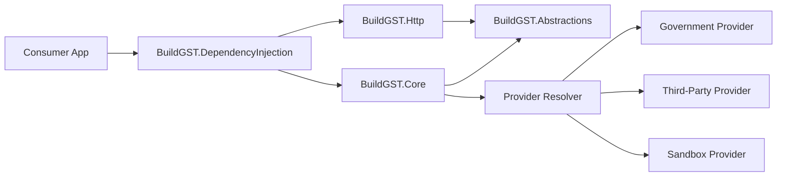

# BuildGST

BuildGST is a reusable GST utility library for .NET designed to support GSTIN validation, GST taxpayer lookup, GST e-invoice JSON generation, and invoice schema validation through a clean, provider-based architecture.

It is structured for reuse across ASP.NET Core applications, worker services, console tools, and internal business platforms that need GST-related capabilities without tightly coupling business logic to a specific API vendor.

## Project Overview

BuildGST provides a modular implementation for common GST workflows:

- GSTIN validation with format and checksum verification
- GST taxpayer lookup through configurable providers
- GST e-invoice JSON generation
- Invoice schema validation using embedded XSD
- dependency injection support
- unit-test-friendly abstractions

The solution uses interface-driven design so validation, lookup orchestration, invoice generation, and provider implementations can evolve independently.

## Features

- GST validation
  - 15-character GSTIN validation
  - state code, PAN structure, entity code, fixed `Z`, and checksum validation
- GST lookup
  - async lookup service
  - strategy-based provider resolution
  - provider switching through configuration
  - sandbox/mock provider for local development and tests
- Invoice generator
  - GST e-invoice JSON generation with `System.Text.Json`
  - tax calculation validation
  - invoice totals validation
  - JSON schema validation against embedded XSD

## Solution Structure

```text
BuildGST.sln
src/
  BuildGST.Abstractions/        Interfaces, models, exceptions, options
  BuildGST.Core/                Validation, lookup orchestration, invoice generation, schema validation
  BuildGST.Http/                HTTP provider base and provider implementations
  BuildGST.DependencyInjection/ IServiceCollection registration extensions
  BuildGST.Demo.Console/        Demo console application
tests/
  BuildGST.Core.Tests/          Unit and behavior tests
```

## Architecture



### Architecture Diagram Explanation

- `BuildGST.Abstractions` contains the contracts, models, options, and exceptions used across the solution.
- `BuildGST.Core` contains the business logic such as GSTIN validation, lookup orchestration, invoice generation, and schema validation.
- `BuildGST.Http` contains infrastructure-specific provider implementations and reusable HTTP provider behavior.
- `BuildGST.DependencyInjection` is the composition layer that wires services and providers into `IServiceCollection`.
- The provider resolver uses the Strategy pattern to select the configured provider at runtime.

## Core Components

- `IGstinValidator`
  - validates GSTIN format and returns validation errors
- `IGstLookupService`
  - validates GSTIN, resolves the configured provider, and fetches taxpayer details
- `IGstApiProvider`
  - provider abstraction for government, third-party, and sandbox implementations
- `IGstApiProviderResolver`
  - resolves the active provider from configuration
- `IEInvoiceJsonGenerator`
  - generates GSTN-style invoice JSON
- `IInvoiceSchemaValidator`
  - validates generated JSON against embedded XSD via JSON-to-XML conversion

## Setup

### Prerequisites

- .NET SDK 9.0 or later for build and test tooling
- compatible consumers can still reference the core libraries targeting `.NET Standard 2.0`

### Build Solution

```powershell
dotnet build .\BuildGST.sln
```

### Run Tests

```powershell
dotnet test .\BuildGST.sln
```

### Run Demo Console App

```powershell
dotnet run --project .\src\BuildGST.Demo.Console\BuildGST.Demo.Console.csproj
```

## Configure Providers

Provider selection is controlled through `GstApiProviderOptions`.

Key options:

- `Provider`
- `BaseUrl`
- `LookupPathTemplate`
- `ApiKey`
- `ApiKeyHeaderName`
- `TimeoutSeconds`

## Dependency Injection Example

```csharp
using BuildGST.Abstractions.Models;
using BuildGST.DependencyInjection;

var services = new ServiceCollection();

services.AddBuildGst(options =>
{
    options.Provider = ProviderType.Government;
    options.BaseUrl = "https://api.example.com/";
    options.LookupPathTemplate = "gst/{gstin}";
    options.ApiKey = "your-api-key";
    options.TimeoutSeconds = 30;
});
```

## Sample Usage Code

```csharp
using BuildGST.Abstractions.Interfaces;
using BuildGST.Abstractions.Models;
using Microsoft.Extensions.DependencyInjection;

var serviceProvider = services.BuildServiceProvider();

var validator = serviceProvider.GetRequiredService<IGstinValidator>();
var lookupService = serviceProvider.GetRequiredService<IGstLookupService>();
var invoiceGenerator = serviceProvider.GetRequiredService<IEInvoiceJsonGenerator>();
var schemaValidator = serviceProvider.GetRequiredService<IInvoiceSchemaValidator>();

var gstin = "29ABCDE1234F1ZW";

if (!validator.IsValid(gstin))
{
    Console.WriteLine(validator.GetValidationError(gstin));
    return;
}

var taxpayer = await lookupService.LookupAsync(gstin);

var invoice = new GstInvoice
{
    Metadata = new GstInvoiceMetadata
    {
        InvoiceNumber = "INV-2026-0001",
        InvoiceDate = "22/03/2026",
        DocumentType = "INV",
        SupplyType = "B2B"
    },
    Seller = new GstInvoiceParty
    {
        Gstin = "27ABCDE1234F1Z0",
        LegalName = "BuildGST Seller Private Limited",
        AddressLine1 = "100 Tax Tower",
        Location = "Mumbai",
        PostalCode = 400001,
        StateCode = "27"
    },
    Buyer = new GstInvoiceParty
    {
        Gstin = taxpayer.Gstin,
        LegalName = taxpayer.LegalName,
        AddressLine1 = "42 GST Avenue",
        Location = "Bengaluru",
        PostalCode = 560001,
        StateCode = "29"
    },
    Totals = new GstInvoiceTotals
    {
        AssessableValue = 1000m,
        CgstValue = 90m,
        SgstValue = 90m,
        IgstValue = 0m,
        TotalInvoiceValue = 1180m
    },
    Items =
    {
        new GstInvoiceItem
        {
            SerialNumber = "1",
            Description = "GST Utility Subscription",
            HsnCode = "998313",
            IsService = true,
            Quantity = 1m,
            UnitPrice = 1000m,
            TaxableAmount = 1000m,
            TotalAmount = 1180m,
            Tax = new GstInvoiceTax
            {
                GstRate = 18m,
                CgstAmount = 90m,
                SgstAmount = 90m,
                IgstAmount = 0m
            }
        }
    }
};

var json = await invoiceGenerator.GenerateAsync(invoice);
var isSchemaValid = schemaValidator.Validate(json);

Console.WriteLine(taxpayer.LegalName);
Console.WriteLine(json);
Console.WriteLine($"Schema valid: {isSchemaValid}");
```

## Testing Instructions

The solution uses xUnit for unit tests and Moq for mocking.

Run all tests:

```powershell
dotnet test .\BuildGST.sln
```

Run a single test project:

```powershell
dotnet test .\tests\BuildGST.Core.Tests\BuildGST.Core.Tests.csproj
```

Current test coverage includes:

- GST validation success and edge cases
- provider resolver behavior
- lookup service success, rejection, cancellation, and failure wrapping
- invoice generation success and validation failures
- schema validation scenarios

## Provider Switching Instructions

Switch providers by changing `options.Provider` during registration.

### Government Provider

```csharp
services.AddBuildGst(options =>
{
    options.Provider = ProviderType.Government;
    options.BaseUrl = "https://government-provider.example/";
    options.LookupPathTemplate = "lookup/{gstin}";
    options.ApiKey = "government-key";
});
```

### Third-Party Provider

```csharp
services.AddBuildGst(options =>
{
    options.Provider = ProviderType.ThirdParty;
    options.BaseUrl = "https://third-party.example/";
    options.LookupPathTemplate = "api/gst/{gstin}";
    options.ApiKey = "third-party-key";
});
```

### Sandbox Provider

```csharp
services.AddBuildGst(options =>
{
    options.Provider = ProviderType.Sandbox;
});
```

The sandbox provider is useful for tests, demos, and local development where live provider integration is not required.

## Error Handling

The library exposes focused exceptions for common failure paths:

- `InvalidGstinException`
- `GstLookupFailedException`
- `GstApiException`

This allows consuming applications to differentiate validation failures from provider or transport failures.

## Future Improvements

- add real provider-specific response mapping for government and commercial GST APIs
- add strongly typed configuration binding from `appsettings.json`
- add structured logging adapters for `ILogger<T>`
- add richer invoice domain models aligned to official GSTN field naming
- add integration tests for live or mocked HTTP provider workflows
- add packaging and NuGet publishing metadata
